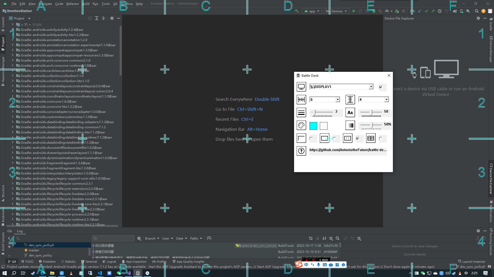
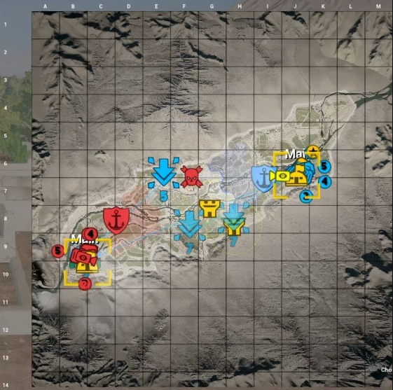
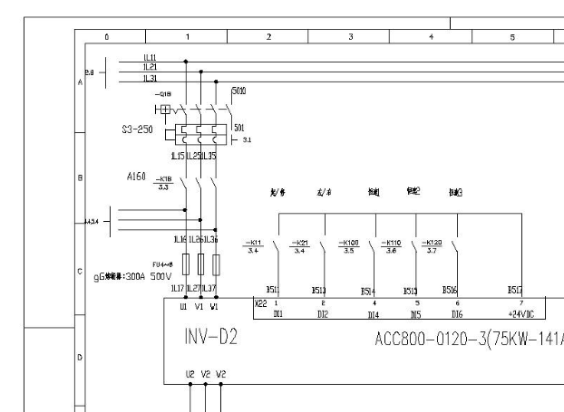
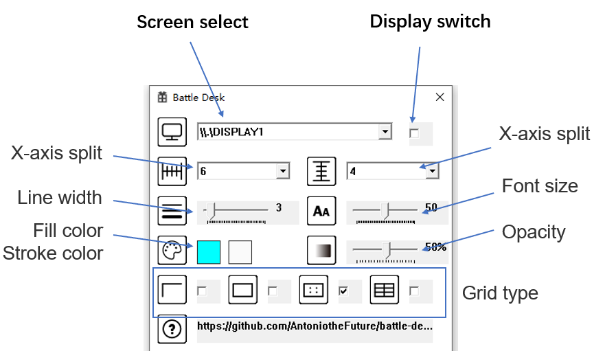

## Summary

Battle Desk can help you quickly locate screen elements when sharing screens with others or conducting remote meetings by overlaying indicators on the screen, inspired by tactical maps or electrical schematics.

## How to use?

1. Download from [release](https://github.com/AntoniotheFuture/battle-desk/releases).
2. Start battle-desk.exe.
3. Config your layout.
4. Teach your screen-sharing partners, if they what to tell which part of screen, just say 'A2' or 'D4' etc.

## Features

- [x] Base configs.
- [x] Windows.
- [ ] MacOS.
- [ ] Mutil monitors support.

## Build

### Windows:

- Visual Studio 2022
- C++
- GDI+
